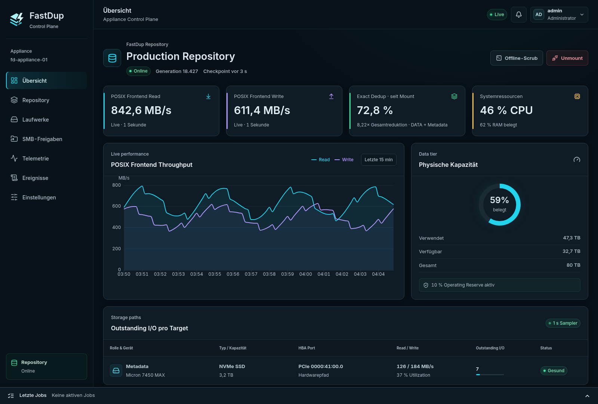
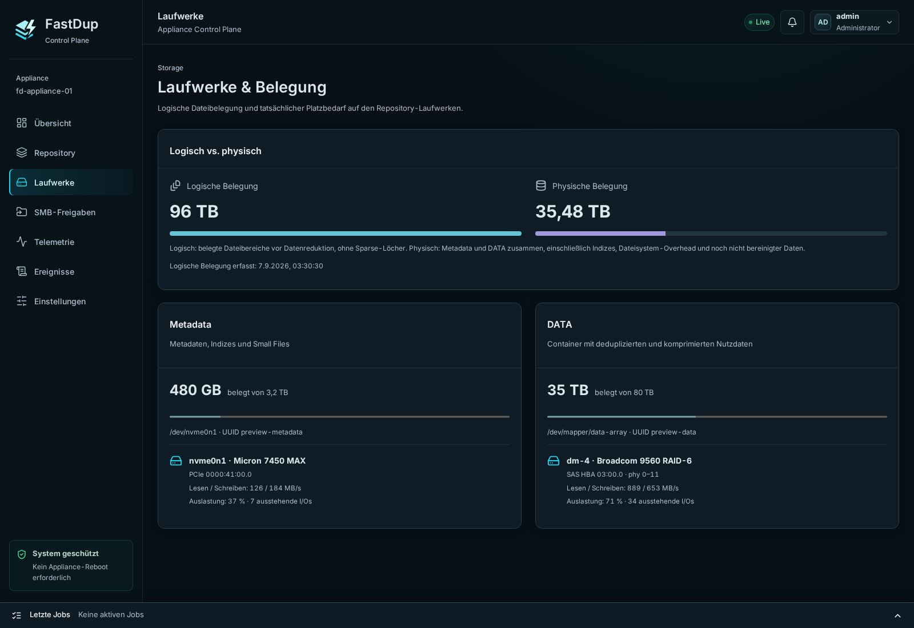
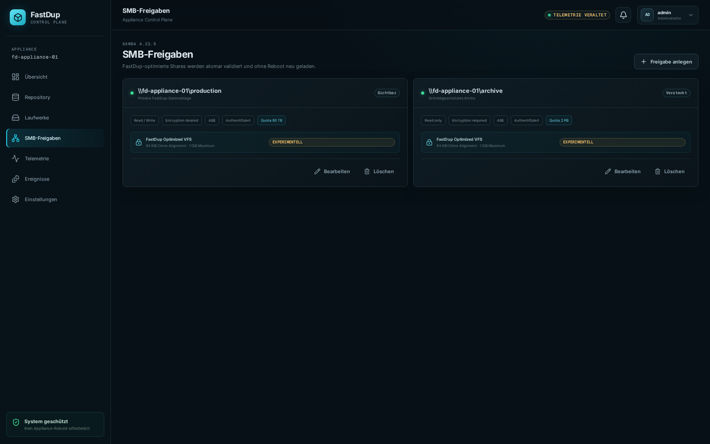

# fastdup

<p align="center">
  <strong>Aus geeigneter x86-64-Hardware wird eine High-Performance Dedup-Appliance—bequem im Browser verwaltet.</strong>
</p>

<p align="center">
  <a href="README.md">English</a> · Deutsch
</p>

<p align="center">
  <a href="https://github.com/ThatIsCraZy/fastdup/releases/latest"></a>
  <a href="LICENSE"></a>
  
</p>

<p align="center">
  <strong><a href="https://github.com/ThatIsCraZy/fastdup/releases/download/v0.5/fastdup-0.5.0-1.el10.x86_64.rpm">RPM herunterladen</a></strong>
  · <a href="https://thatiscrazy.github.io/fastdup/">Produktseite</a>
  · <a href="https://github.com/ThatIsCraZy/fastdup/releases/tag/v0.5">Release-Informationen</a>
</p>

fastdup ist eine experimentelle, softwaredefinierte Single-Node-
Storage-Appliance für Linux. Ein RPM auf geeigneter x86-64-Hardware, getrennte
Metadata- und DATA-Tiers, und schon stehen normale Dateien und Verzeichnisse
über FUSE und SMB/Samba bereit. Eine mehrstufige Reduction-Pipeline und ein
optimierter Rust-Datenpfad zielen auf hohen Durchsatz; die eingebettete
HTTPS-WebUI hält die Administration einfach.

> [!WARNING]
> fastdup ist ein Forschungsprototyp und kein produktionsreifes Backup-Produkt.
> Verwende es nicht als einzige Kopie wichtiger Daten. Die aktuellen Grenzen
> sind weiter unten aufgeführt.

## Gemessen mit 10 vCPUs auf einem Notebook-Prozessor

Die Benchmark-VM lief auf einem Intel Core i7-1370P und sah nur zehn logische
CPUs, AVX2/BMI2 und kein AVX-512:

| Messung | Ergebnis | Umfang |
| --- | ---: | --- |
| Drei serielle SingleStream-SMB-Uploads | **1.022,1 MiB/s** | aktueller Produktionspfad |
| Erster physischer / schnellster Exact-Upload | **601,0 / 1.576,2 MiB/s** | bytegenau geprüfter SMB-Lauf |
| Reduction bei drei Kopien | **67,78 % gespart / 3,104×** | inklusive Metadaten; reine Exact-Dedup ist auf 66,67 % begrenzt |
| SeqCDC-AVX2-/BMI2-Scanner | **9.568 MiB/s** | isolierter Rocky-ISO-Scan in 1-MiB-Slices |
| 50 live, minimal veränderte ISO-Versionen | **49,07× DATA / 46,87× mit Metadaten** | 50/50 Dateien des ersten Zyklus BLAKE3-verifiziert |

Die Werte sind host- und workloadspezifisch und keine SLA-Zusage. Siehe
[aktueller SMB-Nachweis](docs/benchmarks/hot-buffer-reuse-2026-09-01.md),
[601-Sekunden-FUSE-Lauf](docs/benchmarks/io-intensive-fuse-600s.md) und
[interaktive Produktseite](https://thatiscrazy.github.io/fastdup/#performance).

Das Drei-Kopien-Ergebnis ist bewusst kein Maximaltest: Drei identische Kopien
können durch reine Exact-Dedup höchstens 3:1 zeigen. fastdup übertrifft die
dazugehörige Einsparung von 66,67 % bereits inklusive Repository-Metadaten,
weil weitere Reduction-Stufen beitragen. Werte wie 50:1 benötigen genügend
redundante Versionen und einen passenden Datenmix. Der aktuelle Workload mit
50 gleichzeitig live gehaltenen Versionen erreicht 49,07× auf DATA und 46,87×
inklusive sämtlicher allokierter Metadaten; die exakten Ergebnisse stehen im
[aktuellen Reduction-Rerun](docs/benchmarks/iso50-live-reduction-2026-09-02.md).

fastdup geht über eine klassische Exact-Dedup-plus-Kompression-Pipeline hinaus.
Der dauerhafte Default kombiniert SeqCDC Content-Defined Chunking,
BLAKE3-geprüfte Exact Dedup, Sparse-HOLE- und Constant-Byte-FILL-Extents,
gruppiertes adaptives RAW/Zstd mit versionierter Sparschwelle. Workloads mit
`copy_file_range` erhalten zusätzlich Metadata Fast Clone. Ein neu aufbaubarer
Similarity Index mit Depth-1-`ZSTD_PREFIX` ist opt-in.
Inhaltsidentifizierte Dictionaries und Sparse-XOR Delta bleiben klar
gekennzeichnete Forschungspfade; Similarity-Reorder wurde zugunsten der
Restore-Lokalität verworfen. Weil proprietäre Appliance-Interna nicht
vollständig offengelegt sind, behauptet das Projekt keinen unseriös zählbaren
Technikvorsprung. Die Quellen stehen in der
[Recherchegrundlage für Website-Aussagen](docs/research/webpage-performance-reduction-claims-2026-09-02.md).

## Auf Rocky Linux 10 installieren

Benötigt werden:

- Rocky Linux 10 auf x86-64
- Root-Rechte für die RPM-Installation
- zwei leere, physisch getrennte Blockgeräte: eines für Metadata und eines für DATA
- TCP 8080 aus dem Management-Netz erreichbar

Aktuelles Binärpaket herunterladen und installieren:

```bash
curl -LO https://github.com/ThatIsCraZy/fastdup/releases/download/v0.5/fastdup-0.5.0-1.el10.x86_64.rpm
curl -LO https://github.com/ThatIsCraZy/fastdup/releases/download/v0.5/SHA256SUMS
sha256sum --check --ignore-missing SHA256SUMS

sudo dnf install ./fastdup-0.5.0-1.el10.x86_64.rpm
sudo systemctl enable --now fastdup-agent.service fastdup-control.service
```

Danach im Browser öffnen:

```text
https://<appliance-host>:8080/
```

Das erste Zertifikat ist selbstsigniert. Mit `admin` / `fastdup01.` anmelden und
das Startpasswort sofort ersetzen. Die WebUI verlangt mindestens zwölf Zeichen,
bevor sie eine administrative Änderung annimmt.

Das Paket startet absichtlich nur die Management-Dienste. Es formatiert **keine**
Datenträger und mountet nicht automatisch ein Repository.

> [!CAUTION]
> Die Repository-Provisionierung löscht Partitionstabellen und sämtliche Daten
> auf beiden ausgewählten Geräten. Vor dem Fortfahren Modell, Seriennummer, WWN,
> Kapazität und HBA-Pfad in der WebUI prüfen.

## Einfache Verwaltung über die WebUI

Die WebUI ist im RPM enthalten und wird von der lokalen Control Plane
ausgeliefert. Über eine einzige Browseroberfläche kann ein Administrator:

- Metadata- und DATA-Geräte mit Schutz vor gefährlichen Auswahlen provisionieren
- das Repository mounten, sauber aushängen, recovern und offline scrubben
- SMB-Freigaben, Zugriffsregeln, Verschlüsselungsvorgaben und Quotas verwalten
- Durchsatz, Kapazität, Deduplizierung, CPU/RAM, Disk-I/O und Checkpoints überwachen
- Online-GC, Druckschwellen, Auto-Mount, Wartungsfenster, Small-File-Platzierung
  und optionale Advanced Reduction konfigurieren
- Jobs und Alarme prüfen, den Audit-Verlauf exportieren, TLS erneuern und
  Passwörter ändern



<p align="center"><em>WebUI-Vorschau mit Beispieldaten: Repository-Zustand, Durchsatz, Datenreduktion, Kapazität und Disk-I/O.</em></p>

| Sichere Geräteauswahl und Provisionierung | SMB-Freigaben und logische Quotas |
| --- | --- |
|  |  |

<p align="center"><em>Die Screenshots stammen automatisiert aus der echten React-WebUI und verwenden deren mitgelieferte Preview-Daten.</em></p>

## Ersteinrichtung

1. **RPM installieren** und `fastdup-agent` sowie `fastdup-control` wie oben starten.
2. **WebUI öffnen**, das erste Zertifikat akzeptieren oder lokal als
   vertrauenswürdig hinterlegen, anmelden und ein neues Admin-Passwort setzen.
3. Unter **„Laufwerke“** ein zulässiges Metadata-Gerät und ein zulässiges
   DATA-Gerät wählen. Die WebUI schließt Root-, Boot-, Swap-, gemountete,
   gehaltene und physisch überlappende Targets aus.
4. **Destruktive Bestätigung genau prüfen** und das Repository initialisieren.
   fastdup erzeugt und mountet die erforderlichen XFS-Pools mit festen Rollen.
5. Das **Repository mounten**.
6. Unter **„SMB-Freigaben“** einen Share anlegen; Benutzer/Gruppen, Read-only,
   Verschlüsselung, Access-Based Enumeration und optionale logische Quota wählen.
7. Den Betrieb über **„Übersicht“**, **„Telemetrie“** und **„Ereignisse“** überwachen.

TCP 8080 nur für das vorgesehene Management-Netz freigeben. Der SMB-Zugriff
folgt der Samba- und Firewall-Policy des Hosts.

## Tägliche Administration

| Aufgabe | Bereich der WebUI | Hinweise |
| --- | --- | --- |
| Zustand und Kapazität prüfen | **Übersicht** | Live-Durchsatz, Reduktion, Reserve und Disk-I/O |
| Mounten oder sauber aushängen | **Repository** | Unmount stoppt neue Mutationen und checkpointet zuerst |
| Integrität prüfen | **Repository → Offline-Scrub** | Erfordert ein offline geschaltetes Repository |
| Physische Targets verwalten | **Laufwerke** | Stabile Geräteidentitäten statt frei eingegebener Pfade |
| SMB-Shares anlegen/begrenzen | **SMB-Freigaben** | Benutzer/Gruppen, Read-only, Encryption, ABE und logische Quota |
| Historische Metriken ansehen | **Telemetrie** | Durchsatz, Ressourcen, Disk-I/O und Datenreduktion |
| Jobs und Alarme prüfen | **Ereignisse** | Fortschritt, Fehler, Alerts und CSV-Audit-Export |
| Runtime-Policy ändern | **Einstellungen** | GC, Druck, Platzierung, Wartung, TLS und Passwort |

systemd-Slices trennen den Repository-Prozess von der Management Plane. Ein
Neustart der WebUI oder ihres Agents stoppt das gemountete Repository nicht.
Der Repository-Runtime läuft ohne Swap und führt beim Shutdown über `SIGINT`
zuerst einen Checkpoint aus.

## Was fastdup speichert

Anwendungen sehen ein veränderbares POSIX-Dateisystem. Darunter speichert
fastdup unveränderliche, inhaltsidentifizierte Container und Manifeste:

```text
POSIX-/FUSE-/SMB-Write
          │
          ▼
 Live-Namensraum ──► SeqCDC-v1 ──► BLAKE3-256 ──► Exact Lookup
                                                        │
                              vorhandener geprüfter Chunk ◄─┤
                                                        │ neu
                                                        ▼
                                                  RAW oder Zstd
                                                        │
                                                        ▼
                                  Container ──► Manifest ──► Commit-WAL
```

Die dauerhaften Formate bleiben maßgeblich. Exact-/Similarity-Indizes,
Bloom-Filter und Read Caches sind nur Beschleunigung und können neu aufgebaut
werden. Recovery, Offline-Scrub und Writer prüfen dieselben versionierten
Invarianten.

Der aktuelle Dateisystemumfang enthält Random Writes, Sparse Files, Hardlinks,
Symlinks, xattrs/ACLs, Record Locks, reine Metadatenklone über
`copy_file_range`, Crash-Recovery, DATA-Tier-Recovery-Checkpoints, adaptive GC,
logische Quotas pro Share und policygesteuerte Small-File-Platzierung.

## Wartung über die Kommandozeile

Routinearbeiten gehören in die WebUI. Für Recovery oder skriptgesteuerte
Offline-Wartung Repository vorher beenden und aushängen:

```bash
fastdup-maintenance --offline scrub METADATA_ROOT DATA_ROOT
fastdup-maintenance --offline metadata-gc METADATA_ROOT DATA_ROOT
fastdup-maintenance --offline rebuild-exact METADATA_ROOT DATA_ROOT
fastdup-maintenance --offline rebuild-pool-indexes METADATA_ROOT DATA_ROOT
fastdup-maintenance --offline scrub-gc METADATA_ROOT DATA_ROOT
```

Der [Wartungsleitfaden](docs/operations/scrub-and-exact-index-rebuild.md)
beschreibt Recovery, Scrub, Index-Rebuild und GC im Detail.

Software entfernen und Repository-Daten absichtlich behalten:

```bash
sudo dnf remove fastdup
```

## Aktuelle Grenzen

- nur Linux x86-64; das veröffentlichte RPM zielt auf Rocky Linux 10
- benötigt ehrlichen Stable Storage und zwei physisch getrennte XFS-Tiers
- keine eingebaute Device Redundancy, Replikation, WORM, Encryption-at-Rest-
  Policy, Cloud Tier oder Schutz vor Geräteverlust
- POSIX-Umfang und breite Samba-/Client-Konformität noch unvollständig
- Samba Fast Clone bleibt experimentell und ist noch nicht für Veeam qualifiziert
- Advanced Similarity Reduction bleibt bis zu breiterer Workload-Evidenz opt-in
- kein Produktions-Support, Performance-SLA oder Kapazitätsversprechen

Kommerzielle Backup-Appliances wie Dell PowerProtect Data Domain und HPE
StoreOnce bieten ausgereifte Integrationen, Retention, Cyber Resilience und
Support, die fastdup nicht besitzt. fastdup ist eine offene Implementierung für
Evaluation und Storage-Forschung, kein Drop-in-Ersatz.

## Für Entwickler

```bash
cd /source/fastdup

export RUSTUP_HOME=/source/fastdup/.artifacts/rustup
export CARGO_HOME=/source/fastdup/.artifacts/cargo
export CARGO_TARGET_DIR=/source/fastdup/.artifacts/target
export TMPDIR=/source/fastdup/.artifacts/tmp
export PATH=/source/fastdup/.artifacts/cargo/bin:$PATH

mkdir -p "$RUSTUP_HOME" "$CARGO_HOME" "$TMPDIR"
cargo test --workspace --all-targets
cargo clippy --workspace --all-targets -- -D warnings
cargo build --release -p fastdup-appliance
```

Cargo legt `CARGO_TARGET_DIR` selbst an; dieses Verzeichnis nicht vorher
erstellen.

- [Verbindliche Domain-Sprache](CONTEXT.md)
- [Architecture Decision Records](docs/adr/)
- [Spezifikationen dauerhafter Formate](docs/specs/)
- [Testpläne](docs/testing/)
- [Betriebsanleitungen](docs/operations/)
- [Reproduzierbare Benchmarks](docs/benchmarks/)
- [Architektur der Control Plane](docs/operations/control-plane.md)
- [Status und Grenzen des Samba-VFS-Moduls](samba/vfs_fastdup/README.md)

## Lizenz

Der Rust-Workspace und die Projektdokumentation stehen unter der
[Apache License 2.0](LICENSE). Das In-Process-Samba-Modul unter
[`samba/vfs_fastdup`](samba/vfs_fastdup/README.md) steht separat unter
GPL-3.0-or-later, wie für ein Samba-VFS-Modul erforderlich.
