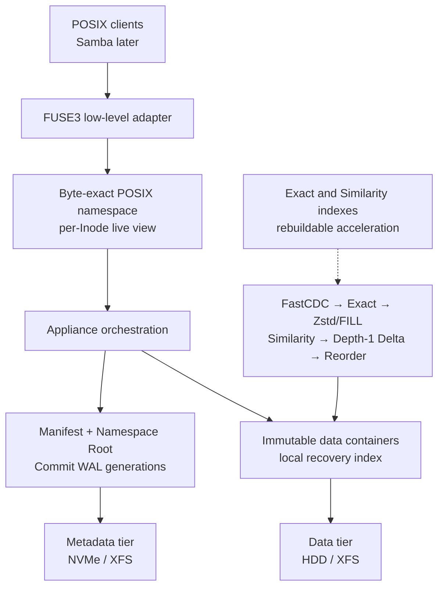

# fastdup

An integrity-first prototype for a single-node POSIX deduplicating storage
appliance, written in Rust.

fastdup is aimed at backup repositories and VM-image workloads: a small number
of very large files, long ingest streams, repeated versions with small changes,
and a smaller set of important XML/JSON files. The design keeps logical content
identity separate from physical placement and treats byte-exact reconstruction
as non-negotiable.

> [!WARNING]
> fastdup is active storage-systems research, not production storage. The
> recoverable namespace currently mounts read-only. The writable FUSE
> checkpoint is deliberately volatile. Do not store your only copy of data in
> it.

## Why this project exists

General-purpose filesystems and block-level deduplication do not expose all the
trade-offs useful for large backup streams. fastdup explores a purpose-built
stack with:

- content-defined chunking instead of fixed block boundaries;
- exact deduplication using BLAKE3-256 identities;
- bounded compression, similarity search, and depth-1 delta encoding;
- immutable containers and manifests with redirect-on-write publication;
- complete on-NVMe indexes as rebuildable acceleration, not sources of truth;
- a low-level FUSE3 POSIX interface, with Samba intended to sit above it;
- explicit crash points, recovery rules, and production-active assertions.

The project follows a TigerStyle-inspired split between:

- **ASSERT** — an impossible internal state; remains fatal in production;
- **VERIFY** — untrusted or durable data failed validation; returns a defined
  corruption/I/O result;
- **AUDIT** — expensive cross-checking, complete in tests and optionally sampled
  in production.

## Current status

| Area | State |
| --- | --- |
| Versioned RAW container format | Implemented, checksummed, self-validating |
| Durable container publication | Implemented with file and directory sync ordering |
| Manifest, Namespace Root, Commit WAL formats | Implemented and versioned |
| Crash recovery | Selects the newest wholly valid generation |
| Recovered POSIX namespace | Implemented as lazy, verified, read-only content |
| Low-level FUSE3 namespace | Mountable volatile checkpoint; writeback disabled |
| FastCDC and Exact Dedup | Implemented in the reference reduction engine |
| Zstd, dictionaries, FILL, similarity, delta, reorder | Implemented and independently benchmarkable in memory |
| Durable reduced-record format | Not implemented yet |
| Ten-second writable commit scheduler | Not implemented yet |
| Persistent verified Chunk-to-Location index | Not implemented yet |
| GC, rebuild/fsck, Samba hardening, device redundancy | Planned later stages |

The read-only recovery boundary is intentional: fastdup will not acknowledge
writes from a recovered mount until it can durably reserve Inode IDs, cut a
consistent mutation prefix, publish data and metadata in order, and commit that
prefix inside the promised ten-second window.

## Architecture



The core visibility rule is:

```text
data durable
  → immutable metadata durable
    → Commit Record durable
      → generation visible
```

Manifests reference logical Chunk IDs, never physical offsets. Relocation and
future GC can therefore change a Chunk's Location Set without rewriting every
file manifest. A Bloom filter or similarity hit may suggest work, but neither
can authorize identity or visibility.

## Reduction policy v1

The reference engine exposes each stage independently so that correctness and
cost can be measured rather than assumed:

| Stage | Version-1 bound |
| --- | --- |
| FastCDC | 16 KiB minimum, 64 KiB target, 256 KiB maximum |
| Exact identity | BLAKE3-256 plus logical-length verification |
| Compression Region | At most 512 KiB |
| Placement Window | At most 64 MiB |
| Similarity bucket | 64 deterministic representatives |
| Similarity query | At most 256 examined, 16 returned |
| Delta trials | At most 4 per target |
| Delta dependency | Depth exactly 1 |

RAW, CDC, Exact, compression, grouping, similarity, delta, and reorder remain
separate feature switches. The current reduction engine is a format-design and
performance oracle; its records are not yet the durable appliance format.

## Measured reference results

These are reproducible development measurements, not production appliance
claims. Full methodology and caveats live in the linked reports.

### Ten Rocky Linux ISO variants

The corpus contains ten 2.07-GB Rocky Linux 10.2 minimal ISO variants, each with
eight deterministic one-byte changes.

| Measurement | Result |
| --- | ---: |
| Logical input | 20,724,449,280 bytes |
| Encoded reference payload | 1,941,262,007 bytes |
| Logical/payload reduction | 10.676× |
| Exact-hit bytes | 90.345% |
| Accepted delta chunks | 80, maximum depth 1 |
| Ten-worker ingest | 46.042 s / 450.1 MB/s |
| Byte-exact verified restore | 22.168 s / 934.9 MB/s |

See [data-reduction-reference-v1](docs/benchmarks/data-reduction-reference-v1.md).
The durable RAW-only container run, which intentionally performs no reduction,
is documented separately in
[stage1-iso-raw-ingest](docs/benchmarks/stage1-iso-raw-ingest.md).

### Structured XML/JSON corpus

The complete reference policy retained 16.196% of logical bytes (6.174× payload
reduction) across the generated structured corpus. Dictionary experiments show
that family dictionaries help only after their object cost is amortized across
multiple files. The fixtures are defined in the
[corpus specification](docs/benchmarks/corpus.md), with results in the reference
report linked above.

## Repository layout

- [`fastdup-format`](crates/fastdup-format) — explicit byte-level serialization
  and validation for containers, manifests, Namespace Roots, and Commit Records.
- [`fastdup-store`](crates/fastdup-store) — durable publication/recovery plus the
  reference reduction engine.
- [`fastdup-posix`](crates/fastdup-posix) — one byte-oriented semantic seam shared
  by deterministic tests and the FUSE adapter.
- [`fastdup-appliance`](crates/fastdup-appliance) — the narrow bridge from a
  verified durable generation to POSIX state.
- [`fastdup-testkit`](crates/fastdup-testkit) — deterministic storage failures,
  crash simulation, corpora, and end-to-end harnesses.

Generated corpora, stores, build products, profiles, and temporary files stay
under `.artifacts/` and are excluded from Git.

## Build and test

### Requirements

- Linux; Rocky Linux is the current development environment;
- the Rust toolchain pinned by [`rust-toolchain.toml`](rust-toolchain.toml);
- a C toolchain for native dependencies;
- FUSE3 and `/dev/fuse` only for the real mount smoke test;
- XFS-backed test paths for storage durability measurements.

The checked-in [Cargo configuration](.cargo/config.toml) keeps build and
temporary output inside the workspace.

```bash
cargo test --workspace --all-targets
cargo clippy --workspace --all-targets -- -D warnings
cargo fmt --all -- --check
```

Run the volatile kernel/FUSE smoke test only on a disposable mount path:

```bash
mkdir -p .artifacts/fuse-mount
cargo run -p fastdup-posix --example fuse_mount_smoke -- \
  "$PWD/.artifacts/fuse-mount"
```

The example prints an explicit volatility warning. Its successful `fsync` does
not imply crash durability.

Run the independently selectable reduction matrix with:

```bash
cargo run --release -p fastdup-store --example reduction_matrix -- \
  --preset all --workers 8 --inflight-mib 128 INPUT...
```

Corpus preparation and the longer ISO harnesses are described in
[`docs/benchmarks/`](docs/benchmarks).

## Integrity and recovery rules

- All durable formats are explicitly serialized and versioned; Rust struct
  layout is never an on-disk format.
- Offsets and lengths are overflow-checked and bounded before allocation.
- Immutable objects are fully re-read and verified before publication.
- Existing object names are reused only after byte and identity verification.
- Recovery never merges pieces from different generations.
- A valid Manifest may name logical Chunks but never unverified physical data.
- Inode IDs are reserved durably before visibility and are never reused after a
  crash-lost allocation window.
- Expected client and storage failures are errors, not assertions.

The exact current layouts and crash protocol are specified in:

- [Container format v1](docs/specs/container-v1.md)
- [Container store v1](docs/specs/container-store-v1.md)
- [Metadata generation v1](docs/specs/metadata-generation-v1.md)
- [POSIX conformance matrix](docs/testing/posix-conformance.md)

## Roadmap

The next production-critical steps are:

1. connect the single-writer checkpoint scheduler to the existing dirty-epoch
   cut/install model;
2. reserve fresh Inode ranges before enabling mutation admission;
3. stream reduction output into durable multi-record containers;
4. segment and rotate the bounded Commit WAL;
5. replace normal-path full-container scans with a verified persistent Location
   index while retaining rebuild-from-truth behavior;
6. add offline scrub/fsck and then redirect-on-write GC;
7. benchmark read locality, prefetch, Samba behavior, and real failure cases;
8. add single-device-loss protection after the MVP correctness baseline.

## Design documentation

Start with the project vocabulary in [CONTEXT.md](CONTEXT.md). Architectural
decisions are recorded in [`docs/adr/`](docs/adr/); benchmark results never
silently override accepted integrity rules. Research notes, such as the delta
chain-depth analysis, remain explicitly non-normative until promoted through an
ADR.

Contributions are welcome, but changes to durable formats or POSIX semantics
should include the corresponding writer, reader/recovery, offline-scrub, and
fault-injection evidence.
