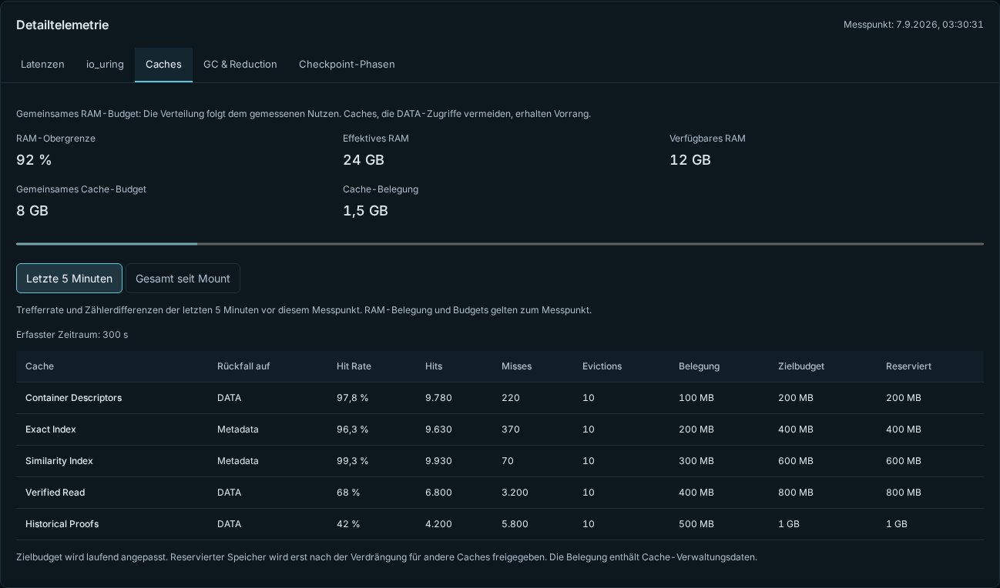

# fastdup

<p align="center">
  <strong>Less storage for the same files. A Rust storage appliance for x86-64, managed in your browser.</strong>
</p>

<p align="center">
  English · <a href="README.de.md">Deutsch</a>
</p>

<p align="center">
  <a href="https://github.com/ThatIsCraZy/fastdup/releases/latest"></a>
  <a href="LICENSE"></a>
  
</p>

<p align="center">
  <strong><a href="https://github.com/ThatIsCraZy/fastdup/releases/download/v0.7/fastdup-0.7.0-1.el10.x86_64.rpm">Download the RPM</a></strong>
  · <a href="https://thatiscrazy.github.io/fastdup/">Product page</a>
  · <a href="https://github.com/ThatIsCraZy/fastdup/releases/tag/v0.7">Release notes</a>
</p>

fastdup is an experimental, software-defined single-node storage appliance for
Linux. Install one RPM on suitable x86-64 hardware, attach separate metadata
and DATA tiers, and expose normal files and directories through FUSE and
SMB/Samba. A multi-stage reduction pipeline and optimized Rust data path target
high throughput, while the embedded HTTPS WebUI keeps administration simple.

> [!WARNING]
> fastdup is a research prototype, not a production backup product. Do not use
> it as the only copy of important data. Current limitations are listed below.

## New in v0.7 · 7 September 2026

- Initialized repositories show logical versus physical usage, Metadata/DATA
  assignments and current device I/O under **Drives**.
- Switch cache hit rates between **Last 5 minutes** and **Total since mount**.
  Historical samples preserve their corresponding counter window.
- Fast mounts from committed metadata, with DATA verification in the background.
- Interrupted scrubs resume durable completed checks after reconciling current
  containers and independent bases, instead of rereading every checked payload.

[Release notes v0.7](docs/releases/v0.7.md) · RPM version **0.7.0-1**.

## New in v0.6.4 · 6 September 2026

- Share free space now equals logical quota minus logically allocated bytes.
  Empty thin-provisioned shares no longer appear partly used by the physical
  storage limit. Physical write admission remains independent.
- Fix nested SMB directory creation for guest sessions (including VeeamZIP).
- Add measured runtime AVX-512 acceleration with AVX2/scalar fallback.

Guest and authenticated SMB access now use a dedicated storage identity and the
required SELinux FUSE permission. Create SMB credentials under **Settings → SMB
users**, then allow the user in the share settings. WebUI and Linux passwords do
not automatically create SMB credentials. Windows guest restrictions remain a
client policy; use an SMB account for authenticated access.

Drive inventory loads immediately after login or the initial password change.
On small Metadata volumes, an oversized Small-File quota is reduced automatically
and a warning shows the requested and effective limits. The Metadata commit
reserve remains protected. See [release notes](docs/releases/v0.6.4.md).

## New in v0.6.1 · 6 September 2026

This patch improves ingest and read hot paths, preserves rechunk work, and fixes
shutdown signal loss and Metadata-I/O failure handling during Commit completion
and fallocate. See the [release notes](docs/releases/v0.6.1.md) and
[crash-consistency results](docs/research/crash-consistency-round-2026-09-06.md).

The source tree supports **persistent online similarity**: new independent
chunks become compression-base candidates during the same mount, without an
offline rebuild. Advanced Reduction can be disabled, enabled, or inherited per
SMB share; newly created WebUI shares default to disabled. Previously stored
dependent data remains readable when the policy is turned off.

The current data path also includes bounded parallel chunk preparation, fewer
read-buffer copies, and finer-grained file locking. Telemetry aggregation now
streams history with bounded memory so management remains responsive.
See the [online similarity implementation](docs/benchmarks/online-similarity-share-policy-2026-09-05.md),
[current SMB measurements](docs/benchmarks/smb-v0.6.1-2026-09-06.md),
and [control-plane measurements](docs/benchmarks/control-plane-memory-2026-09-05.md).

The v0.6.1 release packages version **0.6.1** for Rocky Linux 10 x86-64.
The following benchmarks document the development builds leading to this
release; binary hashes and measurement limits are recorded with each run.

## Measured performance and storage reduction

| Workload | Normal reduction | Advanced Reduction |
| --- | ---: | ---: |
| Three identical ISO uploads over SMB, median throughput | **1,489.4 MiB/s** | **1,313.6 MiB/s** |
| Same SMB series, storage saved including metadata | **67.828%** | **67.913%** |
| 50 Linux 6.12 TAR versions, total repository allocation | **10.93 GiB** | **3.02 GiB** |
| Same Linux corpus, total reduction factor | **6.59:1** | **23.84:1** |
| Same Linux corpus, copy + fsync throughput | **202.48 MiB/s** | **116.92 MiB/s** |

**SMB v0.6.1 (6 September 2026):** medians of three runs per mode on ten
vCPUs, separate XFS metadata and DATA tiers, loopback with signing and encryption
disabled. Each run uploads the same Rocky ISO three times in sequence to a fresh
repository. Storage is measured after 12 seconds with all three files live.
Advanced is **11.8% slower** in this workload and saves an additional **5.0 MiB**;
identical copies mainly benefit from Exact Dedup. Peak observed RSS was
**542.0 / 655.4 MiB** (Normal / Advanced). All six runs passed with zero daemon
swap and successful cleanup; no full hash readback was performed.
[Setup and all six runs](docs/benchmarks/smb-v0.6.1-2026-09-06.md).

**Online similarity:** 72.05 GiB of uncompressed Linux 6.12.1–6.12.50 TAR
streams, two fresh repositories, one uninterrupted mount per mode. Advanced
Reduction used **72.35% less total space**, at **42.25% lower write throughput**.
This run measured allocation and write completion without target readbacks.
It used an earlier development binary than the SMB series above.
[Complete A/B evidence](docs/benchmarks/linux-6.12-online-similarity-2026-09-05.md).

Choose the policy for your workload: identical copies mostly benefit from
Exact Dedup; similar, changed versions can benefit substantially from Advanced
Reduction. These are workload- and host-specific results, not an SLA or a
network throughput guarantee. The earlier synthetic 50-ISO test remains
available separately: [46.87:1 including metadata, with full BLAKE3 readback](docs/benchmarks/iso50-live-reduction-2026-09-02.md).

## Reduction in the write path

The default combines SeqCDC content-defined chunking, BLAKE3-verified Exact
Dedup, sparse HOLE and constant-byte FILL extents, and adaptive grouped
RAW/Zstd compression. `copy_file_range` supports metadata-only Fast Clone.
Opt-in Advanced Reduction trials `ZSTD_PREFIX` and Sparse-XOR against verified,
independently decodable bases, with dependency depth limited to one. Its
persistent online index is rebuildable acceleration; missing candidates lose
an optimization opportunity without changing file contents.

Content-identified Zstd dictionaries remain research. Similarity-based
reordering was rejected in favor of restore locality.

## Why Rust

fastdup's storage core and management services are written in Rust. Safe Rust
prevents classes of memory errors such as use-after-free and out-of-bounds
memory access, reducing a major source of security vulnerabilities in C/C++
systems. Google reported **over 1,000× lower memory-safety vulnerability density**
in Android's Rust code compared with its historical C/C++ code in November
2025. [Google's data and methodology](https://blog.google/security/rust-in-android-move-fast-fix-things/).

That is evidence for the language choice, not a measured security multiplier
for fastdup or a comparison with a specific legacy appliance. fastdup uses
narrow `unsafe` interfaces and native dependencies, including Samba and codec
libraries. Memory safety does not establish overall security or production
readiness. Our [Rust architecture policy](docs/adr/0026-start-with-safe-deep-rust-modules.md)
and [measured unsafe boundaries](docs/benchmarks/hotpath-implementation3-2026-09-05.md#reproduktion-und-unsafe-nachweis)
document the implementation approach.

## Install on Rocky Linux 10

You need:

- Rocky Linux 10 on x86-64
- root access for the RPM installation
- two empty, physically separate block devices: one for metadata and one for DATA
- TCP 8080 reachable from your management network

Download and install the current binary package:

```bash
curl -LO https://github.com/ThatIsCraZy/fastdup/releases/download/v0.7/fastdup-0.7.0-1.el10.x86_64.rpm
curl -LO https://github.com/ThatIsCraZy/fastdup/releases/download/v0.7/SHA256SUMS
sha256sum --check --ignore-missing SHA256SUMS

sudo dnf install ./fastdup-0.7.0-1.el10.x86_64.rpm
sudo systemctl enable --now fastdup-agent.service fastdup-control.service
```

Then open:

```text
https://<appliance-host>:8080/
```

The first certificate is self-signed. Sign in with `admin` / `fastdup01.` and
replace the initial password immediately; the WebUI enforces a minimum of twelve
characters before it accepts any management change.

The package deliberately starts only the management services. It does **not**
format disks or mount a repository automatically.

> [!CAUTION]
> Repository provisioning erases the partition tables and all data on both
> selected devices. Confirm model, serial number, WWN, capacity, and HBA path in
> the WebUI before you continue.

## Simple administration through the WebUI

The WebUI is included in the RPM and served by the local control plane. From a
single browser interface, an administrator can:

- select and provision the metadata and DATA devices with destructive-action guards
- mount, unmount, recover, and offline-scrub the repository
- create and edit SMB shares, access rules, encryption requirements, and quotas
- monitor throughput, capacity, deduplication, CPU/RAM use, disk I/O, and checkpoints
- configure online GC, pressure thresholds, auto-mount, maintenance windows,
  small-file placement, and optional advanced reduction
- inspect jobs and alarms, export the audit history, rotate TLS, and change passwords


<p align="center"><em>WebUI preview with sample data: repository health, throughput, reduction, capacity, and disk I/O.</em></p>

| Logical/physical usage and drive roles | SMB shares and logical quotas |
| --- | --- |
|  |  |

<p align="center"><em>These screenshots are generated from the real React WebUI using its bundled preview dataset.</em></p>



## First-time setup

1. **Install the RPM** and start `fastdup-agent` plus `fastdup-control` as shown above.
2. **Open the WebUI**, accept or locally trust the initial certificate, sign in,
   and set a new administrator password.
3. **Choose “Laufwerke”** and select one eligible metadata device and one eligible
   DATA device. The WebUI excludes root, boot, swap, mounted, holder, and
   physically overlapping targets.
4. **Review the destructive confirmation** and initialize the repository. fastdup
   creates and mounts the required XFS pools with their storage roles.
5. **Mount the repository** from the “Repository” page.
6. **Create an SMB share** under “SMB-Freigaben”; choose users/groups, read-only
   state, encryption, access-based enumeration, and an optional logical quota.
7. **Monitor the system** on “Übersicht”, “Telemetrie”, and “Ereignisse”.

For firewalling, expose TCP 8080 only to the intended management network. SMB
client access follows the host's Samba/firewall policy.

## Everyday administration

| Task | WebUI location | Notes |
| --- | --- | --- |
| Check health and capacity | **Übersicht** | Live frontend throughput, reduction, reserve, and disk I/O |
| Mount or cleanly unmount | **Repository** | Unmount stops new mutations and checkpoints first |
| Run an integrity check | **Repository → Offline-Scrub** | Requires an offline repository |
| Manage physical targets | **Laufwerke** | Uses stable device identities; no free-form device paths |
| Create or restrict SMB shares | **SMB-Freigaben** | Users/groups, read-only, encryption, ABE, and logical quota |
| Inspect historical metrics | **Telemetrie** | Throughput, latency/resource and reduction views |
| Review work and alarms | **Ereignisse** | Job progress, failures, alerts, and CSV audit export |
| Change runtime policy | **Einstellungen** | GC, pressure, placement, maintenance, TLS, and password |

The repository process is isolated from the management plane by systemd slices.
Restarting the WebUI or its agent does not stop the mounted repository. The
repository runtime itself runs with swap disabled and performs a checkpointed
shutdown through `SIGINT`.

## What fastdup stores

Applications see a mutable POSIX filesystem; fastdup stores immutable,
content-identified containers and manifests underneath it:

```text
POSIX / FUSE / SMB write
          │
          ▼
   live namespace ──► SeqCDC-v1 ──► BLAKE3-256 ──► exact lookup
                                                        │
                              existing verified chunk ◄─┤
                                                        │ new
                                                        ▼
                                                   RAW or Zstd
                                                        │
                                                        ▼
                                  container ──► manifest ──► commit WAL
```

The durable formats remain authoritative. Exact/similarity indexes, Bloom
filters, and read caches are only acceleration and can be rebuilt. Recovery,
offline scrub, and writers verify the same versioned invariants.

Current filesystem support includes random writes, sparse files, hardlinks,
symlinks, xattrs/ACLs, record locks, metadata-only `copy_file_range` clones,
crash recovery, DATA-tier recovery checkpoints, adaptive garbage collection,
per-share logical quotas, and policy-selected small-file placement.

## Command-line maintenance

Most routine work belongs in the WebUI. For recovery or scripted offline
maintenance, stop and unmount the repository before using `--offline`:

```bash
fastdup-maintenance --offline scrub METADATA_ROOT DATA_ROOT
fastdup-maintenance --offline metadata-gc METADATA_ROOT DATA_ROOT
fastdup-maintenance --offline rebuild-exact METADATA_ROOT DATA_ROOT
fastdup-maintenance --offline rebuild-pool-indexes METADATA_ROOT DATA_ROOT
fastdup-maintenance --offline scrub-gc METADATA_ROOT DATA_ROOT
```

See the [maintenance guide](docs/operations/scrub-and-exact-index-rebuild.md)
for the exact recovery, scrub, index rebuild, and GC semantics.

To remove the software while intentionally retaining repository data:

```bash
sudo dnf remove fastdup
```

## Current limits

- Linux x86-64 only; the published RPM targets Rocky Linux 10
- requires honest stable storage and two physically separate XFS-backed tiers
- no built-in device redundancy, replication, WORM, encryption-at-rest policy,
  cloud tier, or device-loss protection
- incomplete POSIX and broad Samba/client conformance coverage
- Samba Fast Clone support remains experimental and is not yet Veeam-qualified
- advanced similarity reduction remains opt-in pending broader workload evidence
- no production support, performance SLA, or capacity commitment

Commercial backup appliances such as Dell PowerProtect Data Domain and HPE
StoreOnce provide mature integrations, retention, cyber-resilience, and support
that fastdup does not. fastdup is an open implementation for evaluation and
storage research, not a drop-in replacement.

## For developers

```bash
cd /source/fastdup

export RUSTUP_HOME=/source/fastdup/.artifacts/rustup
export CARGO_HOME=/source/fastdup/.artifacts/cargo
export CARGO_TARGET_DIR=/source/fastdup/.artifacts/target
export TMPDIR=/source/fastdup/.artifacts/tmp
export PATH=/source/fastdup/.artifacts/cargo/bin:$PATH

mkdir -p "$RUSTUP_HOME" "$CARGO_HOME" "$TMPDIR"
cargo test --workspace --all-targets
cargo clippy --workspace --all-targets -- -D warnings
cargo build --release -p fastdup-appliance
```

Cargo creates `CARGO_TARGET_DIR` itself; do not pre-create that directory.

- [Domain language](CONTEXT.md)
- [Architecture Decision Records](docs/adr/)
- [Durable format specifications](docs/specs/)
- [Test plans](docs/testing/)
- [Operations guides](docs/operations/)
- [Reproducible benchmarks](docs/benchmarks/)
- [Control-plane architecture](docs/operations/control-plane.md)
- [Samba VFS status and limits](samba/vfs_fastdup/README.md)

## License

The Rust workspace and project documentation are licensed under
[Apache License 2.0](LICENSE). The in-process Samba module under
[`samba/vfs_fastdup`](samba/vfs_fastdup/README.md) is licensed separately under
GPL-3.0-or-later, as required for a Samba VFS module.
